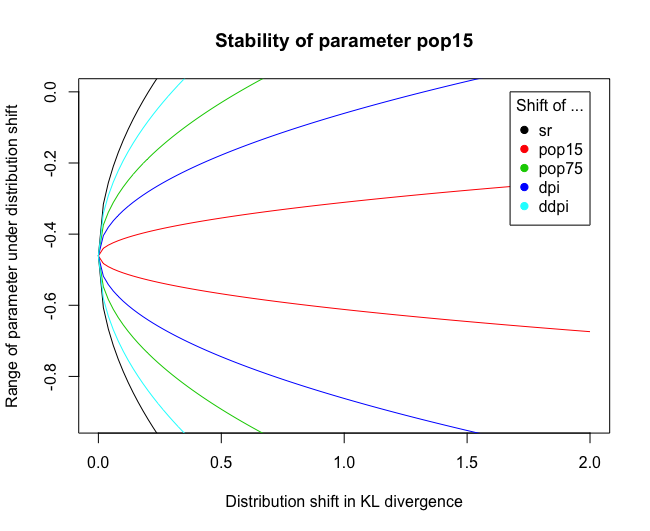

# Distributional stability of lm and glm models

This package provides a function for evaluating the stability of lm and glm models under distribution shift. The method uses a Taylor expansion to simplify the computation of stability values. More details on stability values can be found [here](https://arxiv.org/pdf/2105.03067.pdf).

## How to install

1. The [devtools](https://github.com/hadley/devtools) package has to be installed. You can install it using  `install.packages("devtools")`.
2. The latest development version can then be installied using `devtools::install_github("rothenhaeusler/stability")`.

## Usage

The following code plots the distributional stability of the coefficient "pop15" under a distribution shift in "dpi".
```R
> fit <- lm(sr ~ pop15 + pop75 + dpi + ddpi, data = LifeCycleSavings)
> stability(fit,param="pop15",E="dpi")

 Stability values (approximated via Taylor expansion)
 
s_dpi 
0.687 
```


In our opinion, a parameter should be deemed distributionally unstable if the upper bound or lower bound crosses zero under a distribution shift less than .6. 

If the distribution shift is not specified, the function will evaluate the stability under shifts in all covariates. This allows to judge which type of distribution shift the parameter is most sensitive to. 
```R
> stability(fit,param="pop15")

 Stability values (approximated via Taylor expansion)
 
   s_sr s_pop15 s_pop75   s_dpi  s_ddpi 
  0.863   0.368   0.781   0.687   0.837
```



The function can also be used for generalized linear models. For discrete random variables, there are several parameters that might be of interest. As "parameter" one has to choose the parameter of interest using the dummified notation in summary(model).

```R
> utils::data(anorexia, package = "MASS")
> fit <- glm(Postwt ~ Prewt + Treat,family = gaussian, data = anorexia)
> stability(fit,param = "TreatCont")

 Stability values (approximated via Taylor expansion)
 
s_Postwt  s_Prewt  s_Treat 
   0.334    0.242    0.000
```


Please let us know if you have any feedback!