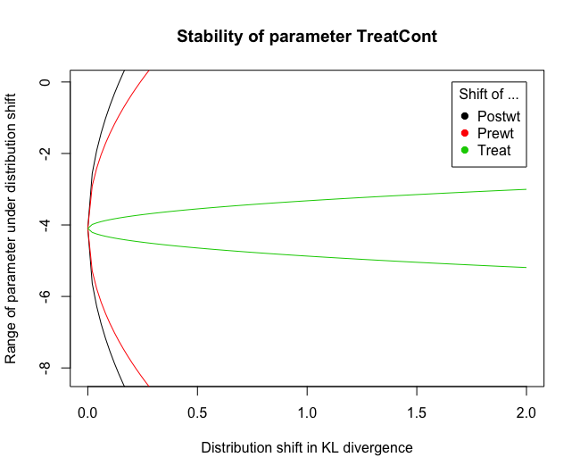

# R-package

This package provides a function for evaluating the stability of lm and glm models under distribution shift.

## How to install

1. The [devtools](https://github.com/hadley/devtools) package has to be installed. You can install it using  `install.packages("devtools")`.
2. The latest development version can then be installied using `devtools::install_github("rothenhaeusler/stability")`.

## Usage

The following code plots the distributional stability of the coefficient "pop15" under distributional shifts in "pop75", "dpi", and "pop15", respectively.
```R
fit <- lm(sr ~ pop15 + pop75 + dpi + ddpi, data = LifeCycleSavings)
stability(fit,param="pop15",E=c("pop75","dpi","pop15"))
```


If the distribution shift is not specified, the function will evaluate the stability under shifts in all covariates.
```R
stability(fit,param="pop15")
```


The function can also be used for generalized linear models.
```R
fit <- glm(Postwt ~ Prewt + Treat,family = gaussian, data = anorexia)
stability(fit,param = "TreatCont")
```



For discrete random variables, there are several parameters that might be of interest. As "parameter" one has to choose the parameter of interest using the dummified notation in summary(model).
